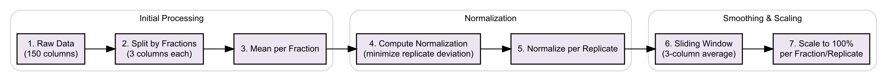
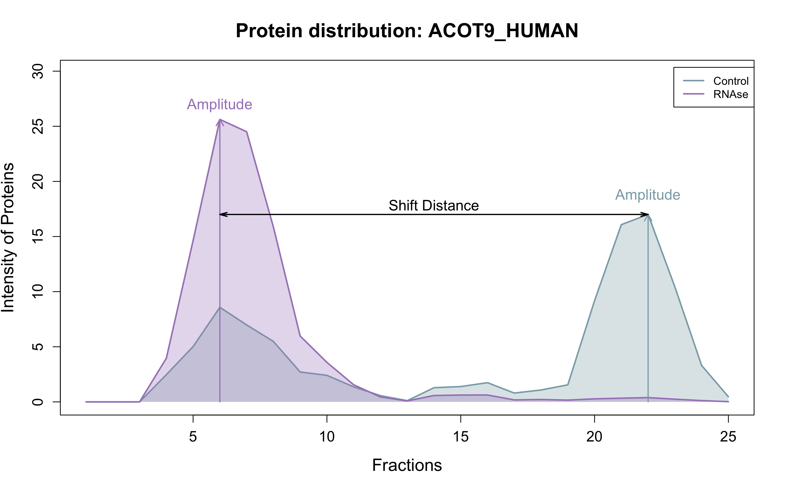

# HeLa Proteome: Decoding RNA Dependency

## Characterization of Proteins Based on Biophysical Properties

Group 4.3 Data Analysis Project

```{r setup, include=FALSE}
knitr::opts_chunk$set(echo = TRUE, message = FALSE, warning = FALSE, fig.width = 10, fig.height = 6, dpi = 300,
  fig.align = "center") 
```

## Objective

| The goal of this analysis is to examine proteomic data from HeLa cells obtained via fractionation experiments with and without RNase treatment. The workflow includes data quality control, normalization, and visualization of signal distribution across fractions. Changes in protein distribution upon RNase treatment are assessed to draw conclusions about the biophysical and functional characteristics of RNA-dependent proteins.

#### Loading the Data

```{r}
MS_Table = read.table("Datensätze/RDeeP_HeLa_Interphase.csv", header=TRUE, row.names=1, sep = ";")
```

## Description of the Dataset

The dataset consists of mass spectrometry-based proteomic measurements from HeLa cells subjected to subcellular fractionation with and without RNase treatment.

-   **Columns** represent individual fraction samples, including information on **fraction number** and **replicate**.

-   **Rows** correspond to **protein identifiers**, each representing a detected protein.

```{r}
# Table dimensions
dim(MS_Table)

# Example column names (proteins)
head(colnames(MS_Table))

# Example row names (fractions)
head(rownames(MS_Table))

# Proteins without signals
which(rowSums(MS_Table) == 0)

# Number of missing values
sum(is.na(MS_Table))

# Check for Numeric Values
all(sapply(MS_Table, is.numeric))
```

-   A total of **7086 proteins** were detected across **150 samples**, covering:

    -   25 fractions

    -   2 treatments (*control* vs. *RNase*)

    -   3 replicates

-   There are **no missing values (NA)** in the dataset.

-   The protein **FHOD3_HUMAN** contains no detectable signal and is removed from the analysis.

-   All entries are **numeric**, allowing direct use in downstream quantitative analysis.

## Setup for Code

### Required Libraries

```{r, message=FALSE, warning=FALSE}
# Plots:
library(ggplot2) #
library(dplyr)   #
library(pracma)  # Für trapz()
library(DiagrammeR)
library(DiagrammeRsvg)
library(rsvg)
library(tidyr)
library(factoextra) # For Elbow and Silhouette methods
library(cluster) # For silhouette plots
library(pheatmap) # For heatmaps
library(RColorBrewer) # For color palettes in plots
```


### Plot Color Scheme and Styling

A consistent and visually appealing color palette is used throughout the code to distinguish data categories clearly.

```{r, results='hide'}
# Hexcodes für unteschiedliche Farben; abgestimmt auf das Poster

 "#C7D5DE" # Balkenüberschirft
 "#DFE3EA" # Hintergrundfarbe
 "#617297" # Überschirftenboxen

"#A786C2"; "#8684C2"; "#617297"; "#7396AD"; "#8CABB5"; "#728083"
"#EDE6F2"; "#E7E6F2"; "#DFE2EA"; "#E2EAEE"; "#E7EEF0"; "#E2E5E6"
"#DBCEE6"; "#CFCDE6"; "#BFC6D5"; "#C6D4DE"; "#D0DDE0"; "#C5CCCD"
"#C9B6D9"; "#B7B5DA"; "#9FAAC1"; "#AABFCC"; "#BACCD2"; "#A9B3B5"
"#7E51A4"; "#504DA4"; "#485571"; "#527286"; "#628691"; "#556062"
"#54366D"; "#35336D"; "#30394B"; "#364B5A"; "#415961"; "#394041"


# Color palette for treatments
treatment_colors = c("Control" = "#8CABB5", "RNase" = "#A786C2")


# Color palette for shifts 
shift_colors = c(
  "strong_left_shift" = "#7E51A4", "moderate_left_shift" = "#C9B6D9","no_shift" = "#D0DDE0","moderate_right_shift" = "#9FAAC1","strong_right_shift" = "#485571")

# Color for gradient1
gradient_colour1 = c("#C9B6D9", "#A786C2", "#7E51A4", "#504DA4", "#30394B")

# Color for gradient2
gradient_colour2 = c("#C6D4DE", "#7396AD", "#527286", "#485571", "#394041")

# Color for RBPs & non_RBPs
color_rbp = c(RBP = "#504DA4",NO_RBP = "#7396AD")

# Einheitliches Poster-Theme
theme_poster = theme_minimal(base_size = 14) +
  theme(
    plot.title = element_text(face = "bold", size = 16, hjust = 0.5),
    axis.title = element_text(face = "bold"),
    axis.text.x = element_text(size = 9),
    legend.title = element_text(face = "bold"),
    legend.position = "right"
  )


```

# Data Cleanup

## Goal

The goal of the data cleanup step is to prepare the raw mass spectrometry data for reliable downstream analysis by addressing technical variability and ensuring the data’s overall quality and consistency. Mass spectrometry measurements often contain noise and systematic differences due to sample handling, instrument fluctuations, or experimental conditions. These technical variations can obscure true biological signals and lead to incorrect conclusions if not properly controlled.

#### Remove protein: FHOD3_HUMAN

```{r Remove proteins without data}
MS_Table = MS_Table[setdiff(rownames(MS_Table), 'FHOD3_HUMAN'),]
```

## Normalization

### Goal

The goal of this normalization workflow is to reduce technical variation across replicates and enable meaningful comparison of protein distributions across fractions and conditions (e.g., control vs. RNase-treated). By aligning replicate intensities and scaling each profile to a common reference, we ensure that biological patterns are not obscured by measurement noise or loading differences.

### Workflow Overview

The diagram below summarizes the key steps of the data cleaning and normalization process:

```{r, include=FALSE}
data_cleaning_workflow = grViz("
digraph cleaning_process {
  graph [rankdir = LR, fontsize = 10, splines = ortho, fontname='Arial']
  node [shape=box, style=filled, fontname='Arial', fontsize=10, penwidth=1.2, fillcolor='#EDE6F2', color=black]
  edge [fontsize=9, color=black]

  subgraph cluster_0 {
    label = 'Initial Processing'
    style = rounded
    color = lightgrey

    A [label = '1. Raw Data\\n(150 columns)']
    B [label = '2. Split by Fractions\\n(3 columns each)']
    C [label = '3. Mean per Fraction']
  }

  subgraph cluster_1 {
    label = 'Normalization'
    style = rounded
    color = lightgrey

    D [label = '4. Compute Normalization\\n(minimize replicate deviation)']
    E [label = '5. Normalize per Replicate']
  }

  subgraph cluster_2 {
    label = 'Smoothing & Scaling'
    style = rounded
    color = lightgrey

    F [label = '6. Sliding Window\\n(3-column average)']
    G [label = '7. Scale to 100%\\nper Fraction/Replicate']
  }


  A -> B -> C -> D -> E -> F -> G
}
")

data_cleaning_workflow
svg = export_svg(data_cleaning_workflow)
rsvg_png(charToRaw(svg), file = "Postervisuals/data_cleaning_workflow.png", width = 3000)


```


This workflow ensures consistent, comparable profiles across all proteins and conditions.


```{r, results='hide'}
Fraktionsnamen = c('Fraction1_Ctrl', 'Fraction1_RNAse', 'Fraction2_Ctrl', 'Fraction2_RNAse','Fraction3_Ctrl', 'Fraction3_RNAse','Fraction4_Ctrl', 'Fraction4_RNAse','Fraction5_Ctrl', 'Fraction5_RNAse','Fraction6_Ctrl', 'Fraction6_RNAse','Fraction7_Ctrl', 'Fraction7_RNAse','Fraction8_Ctrl', 'Fraction8_RNAse','Fraction9_Ctrl', 'Fraction9_RNAse','Fraction10_Ctrl', 'Fraction10_RNAse','Fraction11_Ctrl', 'Fraction11_RNAse','Fraction12_Ctrl', 'Fraction12_RNAse','Fraction13_Ctrl', 'Fraction13_RNAse','Fraction14_Ctrl', 'Fraction14_RNAse','Fraction15_Ctrl', 'Fraction15_RNAse','Fraction16_Ctrl', 'Fraction16_RNAse','Fraction17_Ctrl', 'Fraction17_RNAse','Fraction18_Ctrl', 'Fraction18_RNAse','Fraction19_Ctrl', 'Fraction19_RNAse','Fraction20_Ctrl', 'Fraction20_RNAse','Fraction21_Ctrl', 'Fraction21_RNAse','Fraction22_Ctrl', 'Fraction22_RNAse','Fraction23_Ctrl', 'Fraction23_RNAse','Fraction24_Ctrl', 'Fraction24_RNAse','Fraction25_Ctrl', 'Fraction25_RNAse')

meantabellen = c('mean_Fraction1_Ctrl', 'mean_Fraction1_RNAse', 'mean_Fraction2_Ctrl', 'mean_Fraction2_RNAse','mean_Fraction3_Ctrl', 'mean_Fraction3_RNAse','mean_Fraction4_Ctrl', 'mean_Fraction4_RNAse','mean_Fraction5_Ctrl', 'mean_Fraction5_RNAse','mean_Fraction6_Ctrl', 'mean_Fraction6_RNAse','mean_Fraction7_Ctrl', 'mean_Fraction7_RNAse','mean_Fraction8_Ctrl', 'mean_Fraction8_RNAse','mean_Fraction9_Ctrl', 'mean_Fraction9_RNAse','mean_Fraction10_Ctrl', 'mean_Fraction10_RNAse','mean_Fraction11_Ctrl', 'mean_Fraction11_RNAse','mean_Fraction12_Ctrl', 'mean_Fraction12_RNAse','mean_Fraction13_Ctrl', 'mean_Fraction13_RNAse','mean_Fraction14_Ctrl', 'mean_Fraction14_RNAse','mean_Fraction15_Ctrl', 'mean_Fraction15_RNAse','mean_Fraction16_Ctrl', 'mean_Fraction16_RNAse','mean_Fraction17_Ctrl', 'mean_Fraction17_RNAse','mean_Fraction18_Ctrl', 'mean_Fraction18_RNAse','mean_Fraction19_Ctrl', 'mean_Fraction19_RNAse','mean_Fraction20_Ctrl', 'mean_Fraction20_RNAse','mean_Fraction21_Ctrl', 'mean_Fraction21_RNAse','mean_Fraction22_Ctrl', 'mean_Fraction22_RNAse','mean_Fraction23_Ctrl', 'mean_Fraction23_RNAse','mean_Fraction24_Ctrl', 'mean_Fraction24_RNAse','mean_Fraction25_Ctrl', 'mean_Fraction25_RNAse')

Replikatsnamen = c('Ctrl1_norm_mittel','Ctrl2_norm_mittel','Ctrl3_norm_mittel','RNAse1_norm_mittel','RNAse2_norm_mittel','RNAse3_norm_mittel')

SW_Replikatsnamen = c('SW_Ctrl1','SW_Ctrl2','SW_Ctrl3','SW_RNAse1','SW_RNAse2','SW_RNAse3')

SW_Replikatsnamen_norm = c('SW_Ctrl1_norm','SW_Ctrl2_norm','SW_Ctrl3_norm','SW_RNAse1_norm','SW_RNAse2_norm','SW_RNAse3_norm')

Treatmentnamen = c('Ctrl1_norm','Ctrl2_norm','Ctrl3_norm','RNAse1_norm','RNAse2_norm','RNAse3_norm')

Proteinnamen = rownames(MS_Table)
```

```{r}
# Column means for each submatrix as vector
for (i in 1:50) {
  spalten_index = ((i-1) * 3 + 1):(i * 3)  # Each loop processes 3 columns together
  teilmatrix = MS_Table[,spalten_index]
  
  Mittelwerte = colMeans(teilmatrix)
  
  assign(paste0('mean_', Fraktionsnamen[i]), Mittelwerte)  # Automatically assigns correct name
}
```

```{r}
# Normalization factor per fraction
normf.fraktion = c()
for (i in 1:50) {
    
  # Calculate pairwise differences of the individual means
  abstand_12 = abs(get(meantabellen[i])[1] - get(meantabellen[i])[2])
  abstand_13 = abs(get(meantabellen[i])[1] - get(meantabellen[i])[3])
  abstand_23 = abs(get(meantabellen[i])[2] - get(meantabellen[i])[3])
  
  # Determine the smallest difference and compute the mean of the closest pair
  if (abstand_12 <= abstand_13 && abstand_12 <= abstand_23) {
    normf.fraktion[i] = mean(c(get(meantabellen[i])[1], get(meantabellen[i])[2]))
  } else if (abstand_13 <= abstand_12 && abstand_13 <= abstand_23) {
    normf.fraktion[i] = mean(c(get(meantabellen[i])[1], get(meantabellen[i])[3]))
  } else {
    normf.fraktion[i] = mean(c(get(meantabellen[i])[2], get(meantabellen[i])[3]))
  }
}
```

```{r}
# Normalization factor for each replicate
# Divide the normalization factor per fraction by each replicate’s mean
normf.rep = c()
for (i in 1:50) {
  for (j in 1:3) {
    normf.rep = c(normf.rep, normf.fraktion[i] / get(meantabellen[i])[j])
  }
}
```

```{r}
# Normalize the data to the mean
# Apply replicate-specific normalization factors to each corresponding replicate
MS_Table_norm_mittel = as.data.frame(matrix(NA, nrow = nrow(MS_Table), ncol = 150))
for (i in 1:150) {
  MS_Table_norm_mittel[,i] = normf.rep[i] * MS_Table[,i]
}
colnames(MS_Table_norm_mittel) = colnames(MS_Table)
rownames(MS_Table_norm_mittel) = rownames(MS_Table)
```

```{r}
# Normalize the data to 100 using a sliding window
# Create subtables for individual replicates

for (i in 1:6) {
  spalten_index = seq(from = i, to = 150, by = 6)
  teilmatrix = MS_Table_norm_mittel[, spalten_index]
  
  assign(Replikatsnamen[i], teilmatrix)
}
```

```{r}
# Apply sliding window
for (i in 1:6) {
  
  teilmatrix = data.frame(
    get(Replikatsnamen[i])[1], 
    (get(Replikatsnamen[i])[1:23] + get(Replikatsnamen[i])[2:24] + get(Replikatsnamen[i])[3:25]) / 3, 
    get(Replikatsnamen[i])[25]
  )
  
  assign(SW_Replikatsnamen[i], teilmatrix)  # Automatically assigns the correct name
}
```

```{r}
# Normalize sliding window output to 100%
for (i in 1:6) {
  teilmatrix = (get(SW_Replikatsnamen[i])) * 100 / rowSums(get(SW_Replikatsnamen[i]))
  teilmatrix[is.na(teilmatrix)] = 0  # Handles cases where a fraction's total is 0 → prevents division
  
  assign(SW_Replikatsnamen_norm[i], teilmatrix)  # Automatically assigns the correct name
}
```

```{r}
# Merge into one final table
matrices = list(SW_Ctrl1_norm, SW_Ctrl2_norm, SW_Ctrl3_norm, SW_RNAse1_norm, SW_RNAse2_norm, SW_RNAse3_norm)

MS_Table_norm = c()

for (i in 1:25) {
  for (j in 1:6) {
    MS_Table_norm = as.data.frame(cbind(MS_Table_norm, matrices[[j]][, i]))
  }
}
colnames(MS_Table_norm) = colnames(MS_Table)
rownames(MS_Table_norm) = rownames(MS_Table)
```

### Visualization of Normalization

```{r}
library(ggplot2)
library(dplyr)

# Calculate mean for each column (raw and normalized)
mean_raw = colMeans(MS_Table, na.rm = TRUE)
mean_norm = colMeans(MS_Table_norm, na.rm = TRUE)

# Function to extract metadata from column names
extract_meta = function(sample_names) {
  meta_df = data.frame(Sample = sample_names, stringsAsFactors = FALSE)
  meta_df$Fraction = sub("Fraction(\\d+)_.*", "\\1", meta_df$Sample)
  meta_df$Fraction = factor(meta_df$Fraction, levels = as.character(1:25))
  meta_df$Condition = ifelse(grepl("Ctrl", meta_df$Sample), "Control", "RNase")
  meta_df$Replicate = sub(".*_Rep(\\d+)", "\\1", meta_df$Sample)
  meta_df$Replicate = factor(meta_df$Replicate, levels = c("1", "2", "3"))
  return(meta_df)
}

# Get metadata for raw and normalized data
meta_raw = extract_meta(names(mean_raw))
meta_norm = extract_meta(names(mean_norm))

# Create data frames for raw and normalized means
df_raw = data.frame(Sample = names(mean_raw), Value = mean_raw, Normalization = "Before") %>%
  left_join(meta_raw, by = "Sample")

df_norm = data.frame(Sample = names(mean_norm), Value = mean_norm, Normalization = "After") %>%
  left_join(meta_norm, by = "Sample")

# Combine both data frames
df_all = bind_rows(df_raw, df_norm)

# Percent scale (normalized data is already percent, raw data scaled to percent for comparison)
df_all = df_all %>%
  group_by(Normalization, Condition, Replicate) %>%
  mutate(Value_scaled = ifelse(Normalization == "Before", Value / max(Value, na.rm = TRUE) * 100, Value)) %>%
  ungroup()

# Set factor levels to ensure 'Before' is on the left, 'After' on the right
df_all$Normalization = factor(df_all$Normalization, levels = c("Before", "After"))

# Plot with replicate distinction using line type and point shape
Normalization_plot = ggplot(df_all, aes(x = Fraction, y = Value_scaled, color = Condition, group = interaction(Condition, Replicate))) +
  geom_line(aes(linetype = Replicate), alpha = 0.7) +
  geom_point(aes(shape = Replicate), size = 2) +
  facet_wrap(~Normalization, ncol = 2, scales = "free_y", strip.position = "top") + # Title on top
  theme_poster +
  theme(
    axis.text.x = element_text(angle = 90, vjust = 0.5, hjust = 1),
    strip.placement = "outside",
    strip.background = element_blank(),
    legend.position = "bottom"
  ) +
  scale_color_manual(values = treatment_colors) +
  scale_linetype_manual(values = c("1" = "solid", "2" = "solid", "3" = "solid")) +
  scale_shape_manual(values = c(16, 17, 15)) +
  labs(
    title = "Mean Intensities by Fraction (Raw vs. Normalized)",
    x = "Fraction",
    y = "Mean Intensity (%)",
    color = "Condition",
    linetype = "Replicate",
    shape = "Replicate"
  )

print(Normalization_plot)
```

## Reproducibility

Explanation which correlation method we use:
Pearson, not Spearman, because we have many zeros — so [Pearson]{.underline}

Procedure:
```{r}
# Vector for correlations between columns 1 & 2
kor_Spalte1_Spalte2 = c()
for (i in 1:50) {
  spalten_index = ((i-1) * 3 + 1):(i * 3)  # every loop: 3 columns grouped
  teilmatrix = MS_Table_norm[,spalten_index]  # submatrix for each fraction
  
  kor_a = cor(teilmatrix[,1], teilmatrix[,2], method = 'pearson')  # Pearson correlation between column 1 & 2
  kor_Spalte1_Spalte2 = c(kor_Spalte1_Spalte2, kor_a)  # append to vector
}

# Vector for correlations between columns 2 & 3
kor_Spalte2_Spalte3 = c()
for (i in 1:50) {
  spalten_index = ((i-1) * 3 + 1):(i * 3)  # group 3 columns per loop
  teilmatrix = MS_Table_norm[,spalten_index]  # submatrix for each fraction
  
  kor_b = cor(teilmatrix[,2], teilmatrix[,3], method = 'pearson')  # Pearson correlation between column 2 & 3
  kor_Spalte2_Spalte3 = c(kor_Spalte2_Spalte3, kor_b)  # append to vector
}

# Vector for correlations between columns 1 & 3
kor_Spalte1_Spalte3 = c()
for (i in 1:50) {
  spalten_index = ((i-1) * 3 + 1):(i * 3)  # group 3 columns per loop
  teilmatrix = MS_Table_norm[,spalten_index]  # submatrix for each fraction
  
  kor_c = cor(teilmatrix[,1], teilmatrix[,3], method = 'pearson')  # Pearson correlation between column 1 & 3
  kor_Spalte1_Spalte3 = c(kor_Spalte1_Spalte3, kor_c)  # append to vector
}

kor_tabelle = cbind(kor_Spalte1_Spalte2, kor_Spalte2_Spalte3, kor_Spalte1_Spalte3)
rownames(kor_tabelle) = Fraktionsnamen  # assign fraction names as row names
kor_tabelle
```

## Visualization of Reproducibility

### Violinplot for the r-values of the correlation
```{r}
kor_long = data.frame(
  Fraction = rep(Fraktionsnamen, 3),
  Correlation = c(kor_Spalte1_Spalte2, kor_Spalte2_Spalte3, kor_Spalte1_Spalte3),
  Pair = rep(c("Replicates 1&2", "Replicates 2&3", "Replicates 1&3"), each = 50)
)

Boxplot_Correlations = ggplot(kor_long, aes(x = Pair, y = Correlation, fill = Pair)) +
  geom_boxplot() +
  theme_minimal() +
  labs(title = "Reproducibility of Replicates (Pearson Correlation)",
       x = "Replicate Pair",
       y = "Correlation Coefficient") +
  theme(legend.position = "none")

p_violin = ggplot(kor_long, aes(x = Pair, y = Correlation, fill = Pair)) +
  geom_violin(trim = FALSE) +
  geom_boxplot(width = 0.1, fill = "white") +
  scale_fill_manual(values = c("#7E51A4", "#485571", "#504DA4")) +
  theme_poster +
  labs(
    title = "Reproducibility of Replicates",
    y = "Correlation Coefficient",
    x = NULL  # Remove X-axis title but keep labels
  ) +
  theme(
    axis.title.y = element_text(margin = margin(r = 15)),  # space on Y-axis title
    axis.title.x = element_blank(),                         # no X-axis title
    axis.ticks.x = element_blank(),                         # no ticks on X-axis
    axis.line.x = element_blank(),                          # no bottom axis line
    legend.position = "none"
  )

print(p_violin)

# Save plot as PNG
ggsave(filename = "Postervisuals/Violinplot_Correlations.png", plot = p_violin, width = 8, height = 6)
```

### Example plot for median R-value
```{r}
# 1. Calculate median, ignore NAs
median_r = median(kor_tabelle, na.rm = TRUE)

# 2. Matrix of absolute differences to median
diffs = abs(kor_tabelle - median_r)

# 3. Index of minimal difference (NAs automatically ignored)
min_index = which(diffs == min(diffs, na.rm = TRUE), arr.ind = TRUE)[1, , drop = FALSE]

# 4. Extract fraction and pair (fallback if names missing)
median_fraction = rownames(kor_tabelle)[min_index[1]] %||% min_index[1]
median_pair = colnames(kor_tabelle)[min_index[2]] %||% min_index[2]

# 5. Output results
cat("Median correlation value:", round(median_r, 3), "\n")
cat("Plot for fraction:", median_fraction, "| pair:", median_pair, "\n")
```

```{r}
plot_correlation = function(data, col1, col2, color = "", save_path = "") {
  # Filter complete cases
  df = data %>%
    select(all_of(c(col1, col2))) %>%
    mutate(Protein = rownames(data)) %>%
    pivot_longer(-Protein, names_to = "Sample", values_to = "Value") %>%
    pivot_wider(names_from = Sample, values_from = Value) %>%
    filter(complete.cases(.))
  
  # Calculate correlation
  r = cor(df[[col1]], df[[col2]])
  r_text = paste0("R = ", round(r, 2))
  
  # Create ggplot
  p = ggplot(df, aes_string(x = col1, y = col2)) +
    geom_point(alpha = 0.6, color = color) +
    geom_smooth(method = "lm", se = FALSE, color = "#7E51A4") +
    labs(title = paste("Scatterplot:", col1, "vs", col2),
         x = col1,
         y = col2) +
    theme_poster +
    annotate("text", x = min(df[[col1]], na.rm = TRUE), 
             y = max(df[[col2]], na.rm = TRUE), 
             label = r_text, hjust = 0, vjust = 1, size = 10, color = color)
  
  # Show plot
  print(p)
  
  # Save plot optionally
  if (save_path != "") {
    ggsave(filename = save_path, plot = p, width = 8, height = 8)
  }
}

# plot for median r-value:
plot_correlation(MS_Table_norm, "Fraction18_Ctrl_Rep2", "Fraction18_Ctrl_Rep3", color = "black", save_path = "Postervisuals/vergleich_plot_ggplot.png")
```

# Data exploration

## Goal

Now we have the normalized values for all proteins and can examine our dataset in detail. Our goal is to identify differences between the control and RNase samples. To do this, we first determine both absolute and local maxima for all proteins. To take it a step further, we want to create our own function that can assign each protein to a shift category based on criteria we define ourselves. So now, let’s take a closer look at our proteins.

## Workflow exploration

##### Authors: Mirjam Biollaz, Jette Klempt-Gießing, Alicia Weeber

#### Create subtables for each replicate from the normalized table
```{r}
for (i in 1:6) {

  spalten_index = seq(from = i, to = 150, by = 6) 
  teilmatrix = MS_Table_norm[, spalten_index]
  
  assign(Treatmentnamen[i], teilmatrix) # New subtables named correctly
}
```

#### Create two mean value tables for each replicate, one for control and one for RNAse
```{r}
# Mean values from the replicates
Mittelwert_matrix = t(apply(MS_Table_norm, 1, function(row) {
  sapply(1:50, function(i) {
    spalten_index = ((i - 1) * 3 + 1):(i * 3)
    mean(row[spalten_index])
  })
}))

# Creating two mean subtables for each treatment
Mittelwerte_Kontrolle = as.data.frame(Mittelwert_matrix[, seq(1, 50, by=2)])
Mittelwerte_RNAse = as.data.frame(Mittelwert_matrix[, seq(2, 50, by=2)])

# Naming sub-tables correctly
colnames(Mittelwerte_Kontrolle) = paste0(Fraktionsnamen[seq(1, 50, by=2)])
colnames(Mittelwerte_RNAse) = paste0(Fraktionsnamen[seq(1, 50, by=2)])
```

#### Protein distribution of the two treatments for an example protein to get an overview of the differences
```{r}
zeile = 'ACOT9_HUMAN'

# Kombiniere y-Werte beider Bedingungen
alle_werte = c(Mittelwerte_Kontrolle[zeile,], Mittelwerte_RNAse[zeile,])
ylim_bereich = range(alle_werte, na.rm = TRUE)

# Mehr Platz für die Legende
par(mar = c(5, 4, 6, 2))

# Plot für Kontrolle
plot(1:25, Mittelwerte_Kontrolle[zeile,], type = "l", col = treatment_colors["Control"],
     xlab = "Fraction", ylab = "Intensity in %", main = "Protein distribution",
     ylim = ylim_bereich)

# Plot für RNAse
lines(1:25, Mittelwerte_RNAse[zeile,], col = treatment_colors["RNase"])

# Legende einfügen
legend("topright", inset = c(0, 0.02),  
       legend = names(treatment_colors),
       col = treatment_colors,
       lty = 1, cex = 0.6,              
       bty = "n")

```

#### Determining the maximum values

Now we determine the maximum values using a function that we can then apply to all proteins. The threshold value is set to 2 and, in addition to the local and absolute maxima, plateaus and edge maxima are also taken into account.

```{r}
#Set up function and set threshold value to 2
find_maxima = function(mat, threshold = 2) {
  result = do.call(rbind, lapply(1:nrow(mat), function(i) {
    x = mat[i, ]
    
    # normal Maxima: look at the first numerical derivative, if there is a sign change it is a maximum
    idx = which(diff(sign(diff(x))) == -2) + 1 
    
    # Find plateau maxima: each plateau is checked for a local maximum, if the plateau value is greater than or equal to its direct neighbors, the average value of the plateau is calculated and saved
    rle_x = rle(x)  # Run-Length-Encoding 
    lengths = rle_x$lengths
    values = rle_x$values
    ends = cumsum(lengths)
    starts = ends - lengths + 1
    
    plateau_idx = c()
    for (j in seq_along(values)) {
      # only check Plateaus with lengths > 1 
      if (lengths[j] > 1) {
        start_pos = starts[j]
        end_pos = ends[j]
        
        # values right and left of the plateau
        left_val = if (start_pos > 1) x[start_pos - 1] else -Inf
        right_val = if (end_pos < length(x)) x[end_pos + 1] else -Inf
        
        # Plateau is a lokal Maximum, if it´s value >= neighbor
        if (values[j] >= left_val && values[j] >= right_val) {
          plateau_idx = c(plateau_idx, round(mean(start_pos:end_pos)))
        }
      }
    }
    
    # Combine normal maxima and plateau maxima
    all_idx = sort(unique(c(idx, plateau_idx))) #unique: if values are duplicated they are removed, sort: sort the indices in ascending order
    
    # check edge maxima
    if (x[1] > x[2]) {all_idx = c(1, all_idx)}
    if (x[length(x)] > x[length(x)-1]) {all_idx = c(all_idx, length(x))}
    
    # only keep values > threshold = 2%
    all_idx = all_idx[x[all_idx] > threshold]
    
    # Clean up peaks: If two peaks have only one value between them, remove the smaller one
    if (length(all_idx) >= 2) {
      to_remove = c()
      for (k in 1:(length(all_idx)-1)) {
        if (all_idx[k+1] - all_idx[k] == 2) {
          # Indices of the peaks
          peak1 = all_idx[k]
          peak2 = all_idx[k+1]
          if (x[peak1] >= x[peak2]) {
            to_remove = c(to_remove, peak2)
          } else {
            to_remove = c(to_remove, peak1)
          }
        }
      } # remove the lower value
      if (length(to_remove) > 0) {
        all_idx = setdiff(all_idx, to_remove)
      }
    }
    
    if (length(all_idx) > 0) {
      data.frame(
        Protein = Proteinnamen[i],
        Zeile = i,
        Fraktion = all_idx,
        Wert = x[all_idx]
      )
    } else {
      NULL
    }
  }))
  
  rownames(result) = NULL
  return(result)
}

# Apply maxima function to our mean value tables for both treatments
Mittelwerte_Kontrolle_mat = as.matrix(sapply(Mittelwerte_Kontrolle, as.numeric))
Mittelwerte_RNAse_mat = as.matrix(sapply(Mittelwerte_RNAse, as.numeric))

Maxima_Mittelwerte_Kontrolle = find_maxima(Mittelwerte_Kontrolle_mat)
Maxima_Mittelwerte_RNAse = find_maxima(Mittelwerte_RNAse_mat)
```

```{r}
#Generate two sub-tables for absolute maxima for control and RNAse
library(dplyr)

abs_Maxima_Mittelwerte_Kontrolle = Maxima_Mittelwerte_Kontrolle %>%
  group_by(Protein) %>%                   # Grouping by protein
  slice_max(order_by = Wert, n = 1) %>% # Keep line with maximum maxima
  ungroup()

abs_Maxima_Mittelwerte_RNAse = Maxima_Mittelwerte_RNAse %>%
  group_by(Protein) %>%                   # Grouping by protein
  slice_max(order_by = Wert, n = 1) %>% # Keep line with maximum maxima
  ungroup()
```

#### Identification of shoulder points

Groups of adjacent fractions (at least 4 fractions next to each other) were sought that were not identified as maxima, but still showed a large amount of protein.

```{r}
# Create a function for finding the shoulder points
find_shoulders = function(binary_mat, Proteinnamen) {
  result = do.call(rbind, lapply(1:nrow(binary_mat), function(i) {
    x = binary_mat[i, ]
    rle_x = rle(x)
    lengths = rle_x$lengths
    values = rle_x$values
    ends = cumsum(lengths)
    starts = ends - lengths + 1
    
    schulter_idx = c()
    for (j in seq_along(values)) {
      if (values[j] == 1 && lengths[j] >= 4) {
        start_pos = starts[j]
        end_pos = ends[j]
        schulter_idx = c(schulter_idx, round(mean(start_pos:end_pos)))
      }
    }
    
    if (length(schulter_idx) > 0) {
      data.frame(
        Protein = Proteinnamen[i],
        Zeile = i,
        Fraktion = schulter_idx
      )
    } else {
      NULL
    }
  }))
  
  rownames(result) = NULL
  return(result)
}
```

#### Find shoulder points for the mean value table for control
```{r}
#Temporary removal of protein quantity that is below threshold
Schulter_Mittelwerte_Kontrolle = ifelse(Mittelwerte_Kontrolle > 2, 1, 0) # if greater than 2 then it becomes 1 otherwise the value is set to 0

# Temporary removal of areas around maxima --> are set to 0: within a radius of 3
for (i in 1:nrow(Maxima_Mittelwerte_Kontrolle)) {
  Protein = Maxima_Mittelwerte_Kontrolle$Zeile[i]      # row (Protein)
  Fraktion = Maxima_Mittelwerte_Kontrolle$Fraktion[i]  # column (Fraction)
  
  # Calculate range limits for the columns (check limits!)
  #max(1, fraction-3) ensures that the start index is at least 1 (not <1)
  #min(ncol(...), fraction+3) ensures that the final index is at most the total number of columns (ncol(...))
  Fraktions_bereich = max(1, Fraktion - 3):min(ncol(Schulter_Mittelwerte_Kontrolle), Fraktion + 3)
  
  # Set the ±3 columns to 0 only in this rows 
  Schulter_Mittelwerte_Kontrolle[Protein, Fraktions_bereich] = 0
}
#Apply function for shoulder points
Schulterpunkte_Kontrolle = find_shoulders(Schulter_Mittelwerte_Kontrolle, Proteinnamen)

```

#### Find shoulder points for the mean value table for RNAse
```{r}
#Temporary removal of protein quantity that is below threshold
Schulter_Mittelwerte_RNAse = ifelse(Mittelwerte_RNAse > 2, 1, 0) # if greater than 2 then it becomes 1 otherwise the value is set to 0

# Temporary removal of areas around maxima --> are set to 0: within a radius of 3
for (i in 1:nrow(Maxima_Mittelwerte_RNAse)) {
  Protein = Maxima_Mittelwerte_RNAse$Zeile[i]      # row (Protein)
  Fraktion = Maxima_Mittelwerte_RNAse$Fraktion[i]  # column (Fraktion)
  
  #Calculate range limits for the columns (check limits!)
  #max(1, fraction-3) ensures that the start index is at least 1 (not <1)
  #min(ncol(...), fraction+3) ensures that the final index is at most the total number of columns (ncol(...))
  Fraktions_bereich = max(1, Fraktion - 3):min(ncol(Schulter_Mittelwerte_RNAse), Fraktion + 3)
  
  # Set the ±3 columns to 0 only in this rows
  Schulter_Mittelwerte_RNAse[Protein, Fraktions_bereich] = 0
}
#Apply function for shoulder points
Schulterpunkte_RNAse = find_shoulders(Schulter_Mittelwerte_RNAse, Proteinnamen)
```

#### Merging values
```{r}
# Add values for shoulder points
Schulterpunkte_Kontrolle$Fraktion_gerundet = round(Schulterpunkte_Kontrolle$Fraktion)
Schulterpunkte_Kontrolle$Wert = mapply(function(zeile, fraktion) {
  Mittelwerte_Kontrolle[zeile, fraktion]
}, Schulterpunkte_Kontrolle$Zeile, Schulterpunkte_Kontrolle$Fraktion_gerundet)

Schulterpunkte_RNAse$Fraktion_gerundet = round(Schulterpunkte_RNAse$Fraktion)
Schulterpunkte_RNAse$Wert = mapply(function(zeile, fraktion) {
  Mittelwerte_RNAse[zeile, fraktion]
}, Schulterpunkte_RNAse$Zeile, Schulterpunkte_RNAse$Fraktion_gerundet)


# Merging maxima values and shoulder points for controls
Maxima_Mittelwerte_Kontrolle$Typ = "Maxima"
Schulterpunkte_Kontrolle$Typ = "Schulter"

Combined_Kontrolle = rbind(
  Maxima_Mittelwerte_Kontrolle[, c("Protein", "Zeile", "Fraktion", "Wert", "Typ")],
  Schulterpunkte_Kontrolle[, c("Protein", "Zeile", "Fraktion", "Wert", "Typ")]
)
Combined_Kontrolle = Combined_Kontrolle[order(Combined_Kontrolle$Zeile, Combined_Kontrolle$Fraktion), ]

# Merging maxima values and shoulder points for RNAse
Maxima_Mittelwerte_RNAse$Typ = "Maxima"
Schulterpunkte_RNAse$Typ = "Schulter"

Combined_RNAse = rbind(
  Maxima_Mittelwerte_RNAse[, c("Protein", "Zeile", "Fraktion", "Wert", "Typ")],
  Schulterpunkte_RNAse[, c("Protein", "Zeile", "Fraktion", "Wert", "Typ")]
)
Combined_RNAse = Combined_RNAse[order(Combined_RNAse$Zeile, Combined_RNAse$Fraktion), ]
```

#### P-values of the amplitude difference

... between control and RNAse maxima as the first criterion with which we later want to assign a shift category to the proteins

```{r}
# Rename column names of sub-tables to be able to access them via Combined_Kontrolle and Combined_RNAse
Ctrl1_frakt = Ctrl1_norm
colnames(Ctrl1_frakt) = c(1:25)
Ctrl2_frakt = Ctrl2_norm
colnames(Ctrl2_frakt) = c(1:25)
Ctrl3_frakt = Ctrl3_norm
colnames(Ctrl3_frakt) = c(1:25)

RNAse1_frakt = RNAse1_norm
colnames (RNAse1_frakt) = c(1:25)
RNAse2_frakt = RNAse2_norm
colnames(RNAse2_frakt) = c(1:25)
RNAse3_frakt = RNAse3_norm
colnames(RNAse3_frakt) = c(1:25)

# form Lists from the replicates of control and RNAse
ctrl_reps = list(Ctrl1_frakt, Ctrl2_frakt, Ctrl3_frakt)
rnase_reps = list(RNAse1_frakt, RNAse2_frakt, RNAse3_frakt)

# Dataframe of control and RNAse with only the positions of the peaks
peaks_ctrl = data.frame(Protein = Combined_Kontrolle$Protein, Fraktion = Combined_Kontrolle$Fraktion, Treatment = 'Kontrolle')
peaks_rnase = data.frame(Protein = Combined_RNAse$Protein, Fraktion = Combined_RNAse$Fraktion, Treatment = 'RNase')


# determine same fraction combinations of control and RNAse for the maxima
shared_peaks = merge(peaks_ctrl, peaks_rnase, by = c("Protein", "Fraktion"))

### Determine P values for the various maxima
# Set up dataframe for the results
p_Werte = data.frame()

for (i in 1:nrow(shared_peaks)) {
  protein  = shared_peaks$Protein[i]
  fraktion = as.character(shared_peaks$Fraktion[i])
  
  # Extract control values: via position in shared peaks
  ctrl_vals = sapply(ctrl_reps, function(df) {
    if (protein %in% rownames(df) && fraktion %in% colnames(df)) {
      return(df[protein, fraktion])
    } else {
      return(NA)
    }
  })

  # Extract RNAse values: via position in shared peaks
  rnase_vals = sapply(rnase_reps, function(df) {
    if (protein %in% rownames(df) && fraktion %in% colnames(df)) {
      return(df[protein, fraktion])
    } else {
      return(NA)
    }
  })
   # remove NA values
  ctrl_vals = na.omit(ctrl_vals)
  rnase_vals = na.omit(rnase_vals)

  # If necessary: Add mini fault with identical values, otherwise the variance = 0 and cannot be used for the t-test
  if (length(ctrl_vals) >= 2 && all(abs(ctrl_vals - ctrl_vals[1]) < 1e-10)) {
    ctrl_vals[2] = ctrl_vals[2] + 1e-6
  }
  if (length(rnase_vals) >= 2 && all(abs(rnase_vals - rnase_vals[1]) < 1e-10)) {
    rnase_vals[2] = rnase_vals[2] + 1e-6
  }

  #t-test only if both groups have at least 2 values
  # Assumption for the t-test that replicates are normally distributed in order to be able to perform the t-test at all
  # Variance test with F-test to see whether control and RNAse have the same variance: important for t-test implementation
  if (length(ctrl_vals) >= 2 && length(rnase_vals) >= 2) {
    ftest_p = tryCatch(var.test(ctrl_vals, rnase_vals)$p.value, error = function(e) NA) 
    #The p-value of the F-test (ftest_p) decides whether to assume equal or unequal variances in the next step in the t-test
    #If F-test p-value >0.05 → variances not significantly different
    #If F-test p-value ≤0.05 → variances not equal 
    #t-test, only if variance equals
    t_p = tryCatch(
      t.test(ctrl_vals, rnase_vals, var.equal = (ftest_p > 0.05))$p.value, # Catch possible errors with tryCatch
      error = function(e) NA
    )
  } 
  p_Werte = rbind(p_Werte, data.frame(Protein = protein, Fraktion = fraktion, P_Value = t_p))
}


# FDR-Correction: adjust all p-values in your overall dataset to control the false discovery rate.
p_Werte$adj_p = p.adjust(p_Werte$P_Value, method = "BH")
```

#### Create a function with criteria selected by us that are determined for each protein. These criteria will later predict which Shift_Category each protein will be assigned to.

The following criteria are examined:

-   Number of maximum values for RNAse and control respectively
-   Distances of the maxima between control and RNAse
-   Shift index: Sum of the distances between control and RNAse maxima
-   Amount of protein under the peak curves
-   Loss of amplitude between RNAse and Control
-   Gain of amplitude between RNAse and Control
-   Summed_loss = sum of the loss amplitude
-   Summed_gain = sum of the gain amplitude
-   P-values for amplitude intervals

```{r}
#extract only the columns “Fraction” and “Value” and split this 2-column data based on the grouping variable Combined_Control$Protein.Result: a list in which each element corresponds to a protein ID.
liste_maxima_Ctrl = split(Combined_Kontrolle[, c("Fraktion", "Wert")], Combined_Kontrolle$Protein)
liste_maxima_RNAse = split(Combined_RNAse[, c("Fraktion", "Wert")], Combined_RNAse$Protein)

#For area calculation with trapezoidal rule
library(pracma)  

#define the function
hol_shifts = function(protein, threshold_rel = 0.3) {
  window = 2  # Size of the fraction window

  # get the maximum values of the current protein
  ctrl_maxima = liste_maxima_Ctrl[[protein]]
  rnase_maxima = liste_maxima_RNAse[[protein]]

  #If the protein is not present in one of the lists, the value is assigned the number zero
  if (is.null(ctrl_maxima)) ctrl_maxima = data.frame(Fraktion = numeric(0), Wert = numeric(0))
  if (is.null(rnase_maxima)) rnase_maxima = data.frame(Fraktion = numeric(0), Wert = numeric(0))
  
  #if a value exists, the maximum of the values of this protein is calculated. Then all fractions whose value is at least over threshold are filtered. These are considered as “maxima”
  if (nrow(ctrl_maxima) > 0) {
    max_ctrl = max(ctrl_maxima$Wert)
    ctrl_maxima = ctrl_maxima[ctrl_maxima$Wert >= threshold_rel * max_ctrl, ]
  }
  
  if (nrow(rnase_maxima) > 0) {
    max_rnase = max(rnase_maxima$Wert)
    rnase_maxima = rnase_maxima[rnase_maxima$Wert >= threshold_rel * max_rnase, ]
  }

  #Counting the maxima found
  nb_ctrl_maxima = nrow(ctrl_maxima)
  nb_rnase_maxima = nrow(rnase_maxima)

  # Distances between the maxima
  abstände = c()
  for (i in 1:nb_ctrl_maxima) {
    for (j in 1:nb_rnase_maxima) {
      abstand = rnase_maxima$Fraktion[j] - ctrl_maxima$Fraktion[i]
      abstände = c(abstände, abstand)
    }
  }

  # Function for area calculation with trapezoidal rule to obtain protein quantity
  calc_area = function(df_list, protein, center_frac, window) {
    sapply(df_list, function(df) {
      if (protein %in% rownames(df)) {
        fracs = as.numeric(colnames(df))
        idxs = which(fracs >= (center_frac - window) & fracs <= (center_frac + window))
        if (length(idxs) >= 2) {
          x_vals = fracs[idxs]
          y_vals = as.numeric(df[protein, idxs])
          y_vals = na.omit(y_vals)
          if (length(y_vals) == length(x_vals) && length(y_vals) >= 2) {
            return(trapz(x_vals, y_vals))
          }
        }
      }
      return(NA)
    })
  }

  # Amplitude loss and area under control peaks
  loss_list = c()
  flaeche_kontrolle = c()
  for (i in 1:nb_ctrl_maxima) {
    fraktion_i = as.character(ctrl_maxima$Fraktion[i])
    amp_ctrl = ctrl_maxima$Wert[i]

    amp_rnase = Combined_RNAse$Wert[Combined_RNAse$Protein == protein & Combined_RNAse$Fraktion == fraktion_i]
    if (length(amp_rnase) == 0) amp_rnase = 0

    loss_list = c(loss_list, amp_ctrl - amp_rnase)

    flächen_vals = calc_area(ctrl_reps, protein, as.numeric(fraktion_i), window)
    flaeche_kontrolle = c(flaeche_kontrolle, mean(na.omit(flächen_vals)))
  }

  # Amplitude gain and area under RNAse peaks
  gain_list = c()
  flaeche_rnase = c()
  for (i in 1:nb_rnase_maxima) {
    fraktion_i = as.character(rnase_maxima$Fraktion[i])
    amp_rnase = rnase_maxima$Wert[i]

    amp_ctrl = Combined_Kontrolle$Wert[Combined_Kontrolle$Protein == protein & Combined_Kontrolle$Fraktion == fraktion_i]
    if (length(amp_ctrl) == 0) amp_ctrl = 0

    gain_list = c(gain_list, amp_rnase - amp_ctrl)

    flächen_vals = calc_area(rnase_reps, protein, as.numeric(fraktion_i), window)
    flaeche_rnase = c(flaeche_rnase, mean(na.omit(flächen_vals)))
  }

  # p-values for peaks from previously calculated p_values
  p_values = sapply(ctrl_maxima$Fraktion, function(f) {
    p_val = p_Werte$adj_p[p_Werte$Protein == protein & p_Werte$Fraktion == f]
    if (length(p_val) == 0) NA else p_val[1]
  })

  return(list(
    Protein = protein,
    Anzahl_Kontroll_Maxima = nb_ctrl_maxima,
    Anzahl_RNase_Maxima = nb_rnase_maxima,
    Abstände_Maxima = abstände,
    Shift_idx = sum(abstände),
    Verlust_Amplituden = loss_list,
    Gewinn_Amplituden = gain_list,
    Summierter_Verlust = sum(loss_list),
    Summierter_Gewinn = sum(gain_list),
    Fläche_Kontrolle = flaeche_kontrolle,
    Fläche_RNase = flaeche_rnase,
    p_Werte = p_values
  ))
}

# Examples values for the funciton for the used protein
hol_shifts(zeile)
```

#### Create a dataframe with all these criteria for each protein
```{r}
proteine = unique(c(names(liste_maxima_Ctrl), names(liste_maxima_RNAse)))

ergebnisse = lapply(proteine, function(p) {
  res = hol_shifts(p)
  
  data.frame(
    Protein = res$Protein,
    Anzahl_Kontroll_Maxima = res$Anzahl_Kontroll_Maxima,
    Anzahl_RNase_Maxima = res$Anzahl_RNase_Maxima,
    Shift_idx = res$Shift_idx,
    Summierter_Verlust = res$Summierter_Verlust,
    Summierter_Gewinn = res$Summierter_Gewinn,
    Abstaende_Maxima = paste(res$Abstände_Maxima, collapse = ";"),
    Verlust_Amplituden = paste(res$Verlust_Amplituden, collapse = ";"),
    Gewinn_Amplituden = paste(res$Gewinn_Amplituden, collapse = ";"),
    Fläche_Kontrolle = paste(res$Fläche_Kontrolle,collapse = ";"),
    Fläche_RNase = paste(res$Fläche_RNase,collapse = ";"),
    p_Werte = paste(res$p_Werte, collapse = ";")
  )
})
df_ergebnisse = do.call(rbind, ergebnisse)

#Remove proteins
df_ergebnisse = df_ergebnisse[df_ergebnisse$Protein != 'P210L_HUMAN',]
df_ergebnisse = df_ergebnisse[df_ergebnisse$Protein != 'PKD1_HUMAN',]
df_ergebnisse = df_ergebnisse[df_ergebnisse$Protein != 'TGM7_HUMAN',]
df_ergebnisse = df_ergebnisse[df_ergebnisse$Protein != 'KIF1A_HUMAN',]

```

## Application of Selected Criteria to Identify RNA-dependent Proteins

For each protein, we examined how many criteria it fulfilled and determined an individual shift score for each protein. Based on this score, the proteins can now be divided into the categories: "strong", "moderate" or "no"-shift.

-   score \>= 5: "strong" shift
-   score \>= 4: "moderate" shift
-   score \< 4: "no" shift

```{r}
#create a function for calculation of the score
klassifiziere_protein_shift_streng_v2 = function(row) {
  parse_numeric_vector = function(x) {
    if (is.na(x) || is.null(x) || x == "") return(numeric(0))
    suppressWarnings(as.numeric(unlist(strsplit(as.character(x), ";"))))
  }

  get_centroid = function(x) {
    if (length(x) == 0 || all(is.na(x)) || all(x == 0)) return(NA_real_)
    weighted.mean(seq_along(x), x, na.rm = TRUE)
  }

  score = 0
  richtung = NA
  
  ### 1. category Shift_idx (max 2 points for score)
  shift_idx = suppressWarnings(as.numeric(row[["Shift_idx"]]))
  if (!is.na(shift_idx)) {
    if (abs(shift_idx) >= 2) {
      score = score + 2
      # Shift_idx > 0 --> right
      # Shift_idx < 0 --> left
      richtung = ifelse(shift_idx > 0, "right", "left")
    } else if (abs(shift_idx) == 1) {
      score = score + 1
      richtung = ifelse(shift_idx > 0, "right", "left")
    }
  }
  
  ### 2) Difference in number of maximum between RNAse and control (max 2 points for score)
  max_kontrolle = suppressWarnings(as.numeric(row[["Anzahl_Kontroll_Maxima"]]))
  max_rnase = suppressWarnings(as.numeric(row[["Anzahl_RNase_Maxima"]]))
  if (!is.na(max_kontrolle) && !is.na(max_rnase)) {
    diff_maxima = max_rnase - max_kontrolle
    abs_diff = abs(diff_maxima)
    if (abs_diff >= 2) {
      score = score + 2
      if (is.na(richtung)) richtung = ifelse(diff_maxima > 0, "right", "left")
    } else if (abs_diff == 1) {
      score = score + 1
      if (is.na(richtung)) richtung = ifelse(diff_maxima > 0, "right", "left")
    }
  }

  ### 3) p-value (Significance gives plus points for the score)
  p_vals = parse_numeric_vector(row[["p_Werte"]])
  p_vals_vorhanden = length(p_vals) > 0 && !all(is.na(p_vals))
  signifikant = p_vals_vorhanden && any(p_vals < 0.05, na.rm = TRUE)
  if (signifikant) {
    score = score + 2
  } else if (!p_vals_vorhanden) {
    score = score + 1
    if (is.na(richtung)) richtung = "right" 
  }
  
  ### 4)  Difference in peak areas between RNAse and control 
  flaeche_k = parse_numeric_vector(row[["Fläche_Kontrolle"]])
  flaeche_r = parse_numeric_vector(row[["Fläche_RNase"]])
  delta_flaeche = sum(flaeche_r, na.rm = TRUE) - sum(flaeche_k, na.rm = TRUE)
  if (!is.na(delta_flaeche)) {
    if (abs(delta_flaeche) > 30) {
      score = score + 2
      if (is.na(richtung)) richtung = ifelse(delta_flaeche > 0, "right", "left")
    } else if (abs(delta_flaeche) > 15) {
      score = score + 1
      if (is.na(richtung)) richtung = ifelse(delta_flaeche > 0, "right", "left")
    }
    # special case: shift_idx == 0 but big difference in Area difference under paek   --> Score + 1
    if (!is.na(shift_idx) && shift_idx == 0 && abs(delta_flaeche) > 30) {
      score = score + 1
    }
    # Centroid comparison (center of peak areas) between RNAse and control
    zentroid_k = get_centroid(flaeche_k)
    zentroid_r = get_centroid(flaeche_r)
    if (!is.na(zentroid_k) && !is.na(zentroid_r)) {
      centroid_diff = zentroid_r - zentroid_k
      if (abs(centroid_diff) >= 2) {
        score = score + 1
        if (is.na(richtung)) richtung = ifelse(centroid_diff > 0, "right", "left")
      }
    }
  }
  
  ### 5) Compare summed loss and gain of RNase and control amplitudes, but only if p-value of amplitude intervals is significant
  if (signifikant) {
    sum_gewinn = suppressWarnings(as.numeric(row[["Summierter_Gewinn"]]))
    sum_verlust = suppressWarnings(as.numeric(row[["Summierter_Verlust"]]))
    if (!is.na(sum_gewinn) && !is.na(sum_verlust)) {
      diff_sum = sum_gewinn - sum_verlust
      if (abs(diff_sum) > 10) {
        score = score + 1
      }
    }
  }
  
  ### 6) Compare the position of the amplitudes, but only if the p-value of the amplitude is significant. If amplitude remains the same then no point for score
  if (signifikant) {
    verlust_vec = parse_numeric_vector(row[["Verlust_Amplituden"]])
    gewinn_vec = parse_numeric_vector(row[["Gewinn_Amplituden"]])
    if (length(verlust_vec) > 0 && length(gewinn_vec) > 0) {
      v_idx = which.max(verlust_vec)
      g_idx = which.max(gewinn_vec)
      if (!is.na(v_idx) && !is.na(g_idx) && v_idx != g_idx) {
        if (is.na(richtung)) {
          richtung = ifelse(g_idx > v_idx, "right", "left")
        }
        score = score + 1
      }
    }
  }
  
  if (is.na(richtung)) richtung = "unbekannt"
  
  ### define the scores
  if (score >= 5) {
    kategorie = paste0("strong_", richtung, "_shift")
  } else if (score >= 4) {
    kategorie = paste0("moderate_", richtung, "_shift")
  } else {
    kategorie = "no_shift"
  }
  
  return(list(Score = score, category = kategorie))
}

# Apply and save the function across all proteins and their categories
ergebnisse_liste = apply(df_ergebnisse, 1, klassifiziere_protein_shift_streng_v2)
#Add Shift_Score and Shift_Category to df_ergebnisse
df_ergebnisse$Shift_Score = sapply(ergebnisse_liste, function(x) x$Score)
df_ergebnisse$Shift_Category = sapply(ergebnisse_liste, function(x) x$category)


```

## Visualization of the Protein distribution for our poster

```{r}
zeile = 'ACOT9_HUMAN'

png("Postervisuals/protein_distribution.png", width = 3200, height = 2000, res = 300)

# Combine y-values for both treatments
alle_werte = c(Ctrl1_norm[zeile,], RNAse1_norm[zeile,])
ylim_bereich = range(alle_werte, na.rm = TRUE)

# to get more place at the top (e.g. 15% more)
ylim_bereich[2] = ylim_bereich[2] * 1.15

# first plot for control
plot(1:25, Ctrl1_norm[zeile,], type = "n",
     xlab = "Fractions", ylab = "Intensity of Proteins", main = paste("Protein distribution:", zeile),
     ylim = ylim_bereich, cex.lab=1.4, cex.main=1.6, cex.axis=1.2)

# stain area under the curve
polygon(c(1:25, 25:1),
        c(Mittelwerte_Kontrolle[zeile,], rep(0, 25)),
        col = adjustcolor(treatment_colors["Control"], alpha.f = 0.3), border = NA)
lines(1:25, Mittelwerte_Kontrolle[zeile,], col = treatment_colors["Control"], lwd = 2)

polygon(c(1:25, 25:1),
        c(Mittelwerte_RNAse[zeile,], rep(0, 25)),
        col = adjustcolor(treatment_colors["RNase"], alpha.f = 0.3), border = NA)
lines(1:25, Mittelwerte_RNAse[zeile,], col = treatment_colors["RNase"], lwd = 2)

legend("topright", legend = c("Control", "RNAse"),
       col = treatment_colors, lwd = 2, cex = 0.9, inset = c(0, 0.02), yjust = 0)  

# Find the index of the current protein in the tables
idx_ctrl = which(abs_Maxima_Mittelwerte_Kontrolle[, 1] == zeile)
idx_rnase = which(abs_Maxima_Mittelwerte_RNAse[, 1] == zeile)

# Get maxima for control from table
max_fraktion_ctrl = as.numeric(as.character(abs_Maxima_Mittelwerte_Kontrolle[idx_ctrl, 3]))
max_wert_ctrl = as.numeric(as.character(abs_Maxima_Mittelwerte_Kontrolle[idx_ctrl, 4]))

# Get maxima for RNAse from table
max_fraktion_rnase = as.numeric(as.character(abs_Maxima_Mittelwerte_RNAse[idx_rnase, 3]))
max_wert_rnase = as.numeric(as.character(abs_Maxima_Mittelwerte_RNAse[idx_rnase, 4]))

# Vertical arrows for the maxima
arrows(x0 = max_fraktion_ctrl, y0 = 0,
       x1 = max_fraktion_ctrl, y1 = max_wert_ctrl,
       col = treatment_colors["Control"], lwd = 1.5, length = 0.1)

arrows(x0 = max_fraktion_rnase, y0 = 0,
       x1 = max_fraktion_rnase, y1 = max_wert_rnase,
       col = treatment_colors["RNase"], lwd = 1.5, length = 0.1)

# Labels on the maxima
text(x = max_fraktion_ctrl, y = max_wert_ctrl + 0.10 * max_wert_ctrl,
     labels = "Amplitude", col = treatment_colors["Control"], cex = 1.2)

text(x = max_fraktion_rnase, y = max_wert_rnase + 0.05 * max_wert_rnase,
     labels = "Amplitude", col = treatment_colors["RNase"], cex = 1.2)

# Shift distance arrow between the maxima 
arrow_y = min(max_wert_ctrl, max_wert_rnase)

arrows(x0 = max_fraktion_ctrl, y0 = arrow_y,
       x1 = max_fraktion_rnase, y1 = arrow_y,
       col = "black", lwd = 1.6, angle = 15, length = 0.1, code = 3)  # code=3 = both ends

# Label for the shift
text(x = mean(c(max_fraktion_ctrl, max_fraktion_rnase)),
     y = arrow_y + 0.05 * arrow_y,
     labels = "Shift Distance", col = "black", cex = 1.2)

invisible(dev.off())

```


# Bar plot: show total number of proteins of all shift categories and classify into RBP and non-RBP **das ist noch nicht so wie es soll und das auch ne falsche Funktion** !! nochmal schauen!! + da gibt es noch gar nicht die tabelle - ich hab die jetzt nach ganz unten gepackt

# Das würd ich streichen
# Scatter-plot of the absolute maxima positions for RNAse and control plotted against each other - wie wollen wir den überhaupt verwenden

```{r}
#Generate two sub-tables for absolute maxima for control and RNAse
library(dplyr)

abs_Maxima_Mittelwerte_Kontrolle = Maxima_Mittelwerte_Kontrolle %>%
  group_by(Protein) %>%                   # Grouping by protein
  slice_max(order_by = Wert, n = 1) %>% # Keep line with maximum maxima
  ungroup()

abs_Maxima_Mittelwerte_RNAse = Maxima_Mittelwerte_RNAse %>%
  group_by(Protein) %>%                   # Grouping by protein
  slice_max(order_by = Wert, n = 1) %>% # Keep line with maximum maxima
  ungroup()
```

```{r}
merged = merge(
  abs_Maxima_Mittelwerte_Kontrolle[, c("Protein", "Fraktion")],
  abs_Maxima_Mittelwerte_RNAse[, c("Protein", "Fraktion")],
  by = "Protein",
  suffixes = c("_control", "_rnase")
)

# Calculation of the number of points above, on and below the line y = x
above_line = sum(merged$Fraktion_control > merged$Fraktion_rnase)
on_line = sum(merged$Fraktion_control == merged$Fraktion_rnase)
below_line = sum(merged$Fraktion_control < merged$Fraktion_rnase)

# Output of the values in the console
cat("Anzahl Proteine über der Linie:", above_line, "\n")
cat("Anzahl Proteine auf der Linie:", on_line, "\n")
cat("Anzahl Proteine unter der Linie:", below_line, "\n")

plot(
  y = merged$Fraktion_control,
  x = merged$Fraktion_rnase,
  xlim = c(0, 25),
  ylim = c(0, 25),
  ylab = "Peaks in the control gradient",
  xlab = "Peaks in the RNase gradient",
  pch = 16, col = rgb(0,0,0,0.5),
  main = "Distribution of the maximum values in the fractions"
)
abline(0, 1, col = "blue", lty = 2)

# Add text with the numbers at the bottom left
text(x = 19, y = 2,
     labels = paste0(
       "left_Shift: ", above_line, "\n",
       "no_Shift: ", on_line, "\n",
       "right_Shift: ", below_line),
     adj = 0, cex = 0.8, col = "black")

```

# Data Reduction
## Principal Component Analysis on Original Data
#### Reduction of data-dimensionality by identifying the main axes of variability
##### Authors: Mirjam Biollaz, Jette Klempt-Gießing, Alicia Weeber

```{r}
# PCA with original values
# only Carl's code
pca = prcomp(MS_Table, center = TRUE, scale = TRUE)
variance = (pca$sdev)^2
prop.variance = variance / sum(variance)
names(prop.variance) = 1:length(prop.variance)
barplot(prop.variance[1:20], ylab = 'Proportion of variance') # we only plot the first 20 PCs

plot(pca$x[,1], pca$x[,2], 
     col = 'black', pch = 19,
     xlab = 'PC1', ylab = 'PC2')
```

#### Separation of Normalized Data by Experimental Condition
##### Authors: Hasset Gessese

```{r}
# Number of fractions
n_fractions = 25

# Prepare column indices
control_idx = c()
rnase_idx = c()

for (f in 0:(n_fractions - 1)) {
  start_col = 6 * f
  # Control: columns 1-3 of each fraction
  control_idx = c(control_idx, start_col + 1:3)
  # RNAse: columns 4-6 of each fraction
  rnase_idx = c(rnase_idx, start_col + 4:6)
}

# Extract tables
MS_Control = MS_Table_norm[, control_idx]
MS_RNase = MS_Table_norm[, rnase_idx]
```

## K-Means Clustering

#### PCA-Based K-Means Clustering for Normalization Assessment
##### Authors: Hasset Gessese

This K-means clustering was used as a quality control check after normalization, in order to ensure that the data structure remained interpretable and consistent (shows seperability and stability). Because the optimal k (k=6) from this approach did not align with our modeling results, we did not use these clusters for biological conclusions

```{r kmeans_pca_clustering, message=FALSE, warning=FALSE}

# Perform Principal Component Analysis (PCA) on the normalized data
pca = prcomp(MS_Table_norm, center = TRUE, scale. = TRUE)

# Calculate the proportion of variance explained by each principal component
prop.variance = (pca$sdev)^2 / sum(pca$sdev^2)
pc1_var = round(prop.variance[1] * 100, 1)  # Variance % explained by PC1
pc2_var = round(prop.variance[2] * 100, 1)  # Variance % explained by PC2

# Visualize the variance proportions for the top 10 PCs with a barplot
barplot(prop.variance[1:10], main = "Variance Proportions (Top 10 PCs)", ylab = "Proportion")

# Select the first 5 principal components as features for clustering
pca_data = pca$x[, 1:5]

# Define a custom color palette (poster colors) for cluster visualization
cluster_colors = c(
  "#7E51A4", "#504DA4", "#485571",
  "#7396AD", "#DBCEE6", "#A9B3B5"
)

# Load required libraries for clustering visualization and analysis
library(factoextra)  # For cluster visualization and determining cluster number
library(cluster)     # For silhouette analysis

# Use the Elbow method to estimate the optimal number of clusters (k)
elbow_plot = fviz_nbclust(pca_data, kmeans, method = "wss") +
  ggtitle("Elbow Method – Optimal Number of Clusters") +
  geom_vline(xintercept = 6, linetype = 2, color = "blue")  # Mark k=6 for reference
print(elbow_plot)

# Use the Silhouette method to validate the optimal cluster number
silhouette_plot = fviz_nbclust(pca_data, kmeans, method = "silhouette") +
  ggtitle("Silhouette Method – Optimal Number of Clusters")
print(silhouette_plot)

# Run K-means clustering with k=6 clusters and multiple random starts for stability
set.seed(123)  # Ensure reproducibility
km = kmeans(pca_data, centers = 6, nstart = 25)
cluster_assignment = km$cluster  # Extract cluster membership

# Plot the first two PCs with points colored by cluster assignment
plot(
  pca$x[, 1], pca$x[, 2],
  col = cluster_colors[cluster_assignment],
  pch = 19,
  xlab = paste0("PC1 (", pc1_var, "% Variance)"),
  ylab = paste0("PC2 (", pc2_var, "% Variance)"),
  main = "K-Means Clustering on PCA (k=6)"
)

# Draw convex hulls around points of each cluster to visually group them
library(grDevices)  # For polygon drawing
for (k in 1:max(cluster_assignment)) {
  cluster_points = pca$x[cluster_assignment == k, 1:2]
  if (nrow(cluster_points) >= 3) {  # Need at least 3 points to form a polygon
    hull_indices = chull(cluster_points)          # Indices of convex hull points
    hull_indices = c(hull_indices, hull_indices[1])  # Close the polygon
    polygon(
      cluster_points[hull_indices, ],
      border = cluster_colors[k],
      col = adjustcolor(cluster_colors[k], alpha.f = 0.4),  # Semi-transparent fill
      lwd = 2
    )
  }
}

# Prepare for silhouette analysis to assess cluster quality
n_obs = nrow(pca_data)
sample_threshold = 1000

# If dataset is large, use a random sample of 500 points for efficiency
if (n_obs > sample_threshold) {
  set.seed(42)
  sample_idx = sample(1:n_obs, 500)
  pca_sample = pca_data[sample_idx, ]
  cluster_sample = cluster_assignment[sample_idx]
  dist_sample = dist(pca_sample)  # Compute distance matrix on the sample
  sil = silhouette(cluster_sample, dist_sample)
  message("The silhouette plot is based on a sample of 500 observations")
} else {
  # Otherwise, compute silhouette on full dataset
  dist_matrix = dist(pca_data)
  sil = silhouette(cluster_assignment, dist_matrix)
}

library(factoextra)  # For silhouette visualization

# Calculate average silhouette width overall and per cluster
avg_sil_width = mean(sil[, "sil_width"])
avg_sil_per_cluster = tapply(sil[, "sil_width"], sil[, "cluster"], mean)

# Prepare annotation text showing average silhouette widths
label_text = paste0("Average Silhouette Width: ", round(avg_sil_width, 3), "\n",
                     paste0("Cluster ", names(avg_sil_per_cluster), ": ",
                            round(avg_sil_per_cluster, 3),
                            collapse = "\n"))

# Generate silhouette plot with cluster colors and annotated averages
sil_plot = fviz_silhouette(sil, palette = cluster_colors) +
  ggtitle("Silhouette Plot for K-Means Clustering") +
  theme(plot.title = element_text(hjust = 0.5))

# Add annotation text to the plot
sil_plot +
  annotate("text",
           x = Inf, y = Inf,
           label = label_text,
           hjust = 1.05, vjust = 1.05,
           size = 3,
           fontface = "italic")

```

# das muss doch weiter runter
!! warum ist hier noch kein Wort warum wir das nicht verwenden!!
## Visualization of a PCA defined by 5 shift categories

#### PCA plot with potential biological conditions (no shift, moderate left shift, strong left shift, moderate right shift, strong right shift)

##### Authors: Alicia Weeber

```{r}
# Your PCA object
pca = prcomp(MS_Table_norm, center = TRUE, scale. = TRUE)

# PCA scores (coordinates of the proteins on the PCs)
scores = pca$x

# Get the shift categories from the results table
shift_kategorie = df_ergebnisse[,14]  # Column 14

# Check that the order of categories matches the PCA scores
# If MS_Table_norm and df_ergebnisse have the same row order, it's fine.
# If not, you need to make sure they are matched properly!

# Convert categories to a factor (optionally with defined order)
shift_kategorie = factor(shift_kategorie, levels = c("no_shift",
                                                     "moderate_left_shift",
                                                     "strong_left_shift",
                                                     "moderate_right_shift",
                                                     "strong_right_shift"))

# Layout: 1 row, 2 columns (increase space for legend)
layout(matrix(c(1,2), 1, 2), widths=c(3.5,1.5))  # Adjusted layout to avoid overlap

# PCA plot
par(mar=c(5,4,4,2))  # Slightly larger right margin for spacing
plot(scores[,1], scores[,2],
     col=shift_colors,
     pch=19,
     xlab="PC1", ylab="PC2",
     main="PCA: Coloring by Shift Category")

# Legend in separate panel
par(mar=c(2,0,2,0))  # Minimal vertical padding
plot.new()           # empty plot window
legend("center", legend=levels(shift_kategorie),
       col=shift_colors, pch=19, title="Shift Category", cex=0.9)
```

# Data Modelling

## General goal of data modelling:

The general goal of the data modelling is on the one hand to evaluate how well the classification of RBPs oder non-RBPs based on the shift score is. On the other hand the main goal is to further analyze and characterize the identified RNA-dependent proteins by their biophysical characteristics which is done by performing linear and logistic regression analyses.

#### Loading the data from R-DeeP and creating a table of RBP listed proteins

```{r}
raw = readLines("Datensätze/Table_HS_RBP.txt")
raw_data = raw[7:length(raw)]
clean_data = gsub('\\"', '', raw_data)
writeLines(clean_data, "cleaned_table.txt")
Table_HS_RBP = read.delim("cleaned_table.txt",
                    sep = "\t",
                    header = TRUE,
                    stringsAsFactors = FALSE,
                    check.names = FALSE)
```

#### Loading the data from R-DeeP and creating a table of proteins listed as NO_RBP

```{r}
raw = readLines("Datensätze/Table_HS_Non_RBP.txt")
raw_data = raw[7:length(raw)]
clean_data = gsub('\\"', '', raw_data)
writeLines(clean_data, "cleaned_table.txt")
Table_HS_NO_RBP = read.delim("cleaned_table.txt",
                    sep = "\t",
                    header = TRUE,
                    stringsAsFactors = FALSE,
                    check.names = FALSE)
```

```{r}
# Combining the tables "RBP_Table" and "No_RBP_Table" 
rbp_cols = colnames(Table_HS_RBP)

#selecting columns excisting in both tables
existing_no_rbp_cols = intersect(rbp_cols, colnames(Table_HS_NO_RBP))

# NO_RBP_Table with the same columns
No_RBP_Table_aligned = Table_HS_NO_RBP[, existing_no_rbp_cols]

# Adding missing columns with NA
missing_cols = setdiff(rbp_cols, existing_no_rbp_cols)
for (col in missing_cols) {
  No_RBP_Table_aligned[[col]] = NA
}
# Same order of the columns in both tables
No_RBP_Table_aligned = No_RBP_Table_aligned[, rbp_cols]

# Categorizing the proteins based on their original table
Table_HS_RBP$Kategorie = "RBP"
No_RBP_Table_aligned$Kategorie = "NO_RBP"

# Keeping the same entries a sin Table_MS_norm
RBP_Table = Table_HS_RBP[Table_HS_RBP$Entry_Name %in% rownames(MS_Table_norm), ]
No_RBP_Table = No_RBP_Table_aligned[No_RBP_Table_aligned$Entry_Name %in% rownames(MS_Table_norm), ]

# Combinig both tables for further analysis
combined_table = rbind(RBP_Table, No_RBP_Table)

```

```{r}
# Loading data from Uniprot for more characteristics of the proteins
library(readr)
library(dplyr)

df_uniprot = read_tsv("Datensätze/Uniprot_infos2.tsv", comment = "#", quote = "")

df_uniprot_counts = df_uniprot %>%
  mutate(
    Zinc_Count      = ifelse(is.na(`Zinc finger`)      | `Zinc finger` == "",      NA, lengths(strsplit(`Zinc finger`, ";\\s*"))),
    Coil_Count      = ifelse(is.na(`Coiled coil`)      | `Coiled coil` == "",      NA, lengths(strsplit(`Coiled coil`, ";\\s*"))),
    Signal_Count    = ifelse(is.na(`Signal peptide`)   | `Signal peptide` == "",   NA, lengths(strsplit(`Signal peptide`, ";\\s*"))),
    Glyco_Count     = ifelse(is.na(`Glycosylation`)    | `Glycosylation` == "",    NA, lengths(strsplit(`Glycosylation`, ";\\s*"))),
    Disulfide_Count = ifelse(is.na(`Disulfide bond`)   | `Disulfide bond` == "",   NA, lengths(strsplit(`Disulfide bond`, ";\\s*"))),
    TM_Count        = ifelse(is.na(`Transmembrane`)    | `Transmembrane` == "",    NA, lengths(strsplit(`Transmembrane`, ";\\s*")))
  ) %>%
  select(Entry, `Entry Name`, Zinc_Count, Coil_Count, TM_Count)

# Comining the new characterisitics
combined_table = combined_table %>%
  left_join(df_uniprot_counts, by = c("Entry_Name" = "Entry Name"))
```

```{r}
# adding the biophysical characteristics of the proteins in df_ergebnisse for the regression analysis
phys_traits = combined_table[, c("Entry_Name", "Mass_kDa", "Length_AA", "pI", "Listing_Count","Zinc_Count", "Coil_Count", "RBP2GO_Score", "TM_Count")]


df_ergebnisse_phys = merge(df_ergebnisse, phys_traits,
                   by.x = "Protein", 
                   by.y = "Entry_Name", all = FALSE)

df_ergebnisse_phys$RBP_Status = ifelse(df_ergebnisse_phys$Listing_Count >= 5, "RBP", "NO_RBP")

# Classification of the proteins as RBP/ non-RBP based on their shift scores
df_ergebnisse_phys$RBP_nach_Score = ifelse(df_ergebnisse_phys$Shift_Category == "no_shift", "NO_RBP", "RBP")
df_ergebnisse_phys$RBP_nach_Score = factor(df_ergebnisse_phys$RBP_nach_Score, levels = c("NO_RBP", "RBP"))
```

### Evaluating the RBP classification based on the shift category and shift score by comparing it to the data from R-DeeP

To compare the classification of proteins based on the Shift Score (predicted RBP status) with the reference classification from a database (R-DeeP) (actual RBP status), a confusion matrix is used. Based on this, standard classification performance metrics, including accuracy, precision, recall, specificity, and the F1 score are calculated.

```{r}
conf_matrix = table(df_ergebnisse_phys$RBP_Status, df_ergebnisse_phys$RBP_nach_Score)
colnames(conf_matrix) = c("predicted_NO_RBP", "predicted_RBP")
rownames(conf_matrix) = c("actual_NO_RBP", "actual_RBP")
conf_matrix

TN = 4578
FP = 800
FN = 985
TP = 697
# fuction to calculate the classification metrics
calc_metrics = function(TP, TN, FP, FN) {
  accuracy = (TP + TN) / (TP + TN + FP + FN)
  PPV = TP / (TP + FP)
  sensitivity = TP / (TP + FN)  
  specifity = TN / (TN + FP)
  f1_score = 2 * (PPV * sensitivity) / (PPV + sensitivity)
  
  # Ergebnisse als Dataframe
  metrics_df = data.frame(
    Metric = c("accuracy", "PPV", "sensitivity", "specifity", "f1_score"),
    Value = c(accuracy, PPV, sensitivity, specifity, f1_score)
  )
  return(metrics_df)
}

testvalues = calc_metrics(TP, TN, FP, FN)
print(testvalues)
```

## Linear regression analysis: Isoelectric point and mass as predictors for the shift_score

Several linear regression analyses were performed to find correlations between different biophysical characteristics of the proteins and the Shift score. Many of those analyses are not shown anymore because they all did not identify significant predictors for the shift score. One linear regression analysis is performed with the isoelectric point and mass of the proteins as predictors for their shift score. The goal of this regression analysis is to find out whether those two biophysical traits have a significant impact on the Shift_Score and therefore on the categorization of the proteins as RBP or NO_RBP.

```{r}
library(DiagrammeR)
library(rsvg)
library(DiagrammeRsvg)

overview_linear = grViz("
digraph flowchart {
  graph [layout = dot, rankdir = TB]

  # Defining knots
  pi [label = 'pI', shape = box, style = filled, fillcolor = '#A786C2']
  Mass_kDa [label = 'Mass', shape = box, style = filled, fillcolor = '#8684C2']
  Shift_Score [label = 'Shift_Score', shape = box, style = filled, fillcolor = '#617297']

  # arrows
  pi -> Shift_Score
  Mass_kDa -> Shift_Score
}
")
overview_linear
rsvg_png(charToRaw(export_svg(overview_linear)), "flussdiagramm_shift_score.png", width = 1000, height = 800)
```

```{r}
model_linear = lm(Shift_Score ~ pI + Mass_kDa, data = df_ergebnisse_phys)
summary(model_linear)
```

Both, the isoelectric point as well as the mass have a significant correlation with the Shift_Score because the p-value for both coefficients is significant. The correlation between those two characteristics and the shift score is visualized below.

```{r}
df_plot = df_ergebnisse_phys[complete.cases(df_ergebnisse_phys[, c("RBP_nach_Score", "Mass_kDa", "pI")]), ]
df_plot = df_plot[df_plot$Mass_kDa < 2000, ]
df_plot$predicted_score = predict(model_linear, newdata = df_plot, type = "response")

ggplot(df_plot, aes(x = Mass_kDa, y = pI, color = predicted_score)) +
  geom_point(size = 2, alpha = 0.7) +
  scale_color_gradientn(colours = gradient_colour1) +
  labs(title = "Shift_Score based on mass and pI",
       x = "Mass (kDa)", y = "Isoelectric point (pI)",
       color = "Score") +
  theme_poster
```

```{r}
# density distribution of pI and mass indicating a difference between RBP and NO_RBP
ggplot(df_ergebnisse_phys, aes(x = Mass_kDa, y = pI)) +
  stat_density_2d(aes(fill = ..level..), geom = "polygon") +
  facet_wrap(~RBP_nach_Score) +
  labs(x = "Mass (kDa)", y = "pI", title = "Density of mass and pI for RBP classification") +
  theme_minimal()
```

```{r}
# pI und Masse isoliert betrachten als Prädiktor für den Shift Score
# Zusammenhang zwischen Veränderung von pI bzw. Masse und dem shift score
# Fläche ist 95% Konfidenzintervall

library(effects)

plot(allEffects(model_linear), main = "Teil-Effekte der Prädiktoren auf Shift Score")
```

The R-squared value of the regression analysis is 0.03363 indicating that the isoelectric point and mass alone are not sufficient enough to predict the Shift_Score of the proteins. This result is visualized below. Both traits have a linear correlation with the shift score but there is a big deviation noticeable showing that these traits alone do not eexplain the Shift_Score.

```{r}
ggplot(df_plot, aes(x = pI, y = Shift_Score, color = Shift_Category)) +
  geom_point(alpha = 0.6) +
  geom_smooth(method = "lm", se = FALSE, color = "black") +
  scale_color_manual(values = shift_colors, name = "Shift Category") +
  labs(title = "Influence of pI on shift score",
       x = "Isoelectric point (pI)",
       y = "Shift score") +
  theme_poster

ggplot(df_plot, aes(x = Mass_kDa, y = Shift_Score, color = Shift_Category)) +
  geom_point(alpha = 0.6) +
  geom_smooth(method = "lm", se = FALSE, color = "black") +
  scale_color_manual(values = shift_colors, name = "Shift Category") +
  labs(title = "Influence of mass on shift score",
       x = "Mass (kDa)",
       y = "Shift score") +
  theme_poster

```

## Data reduction and cluster analysis

Performing a data reduction and cluster analysis based on the coefficients of the linear regression analysis, the goal is to find out the number of clusters and comparing those with the assignment of the proteins in different shift categories.

```{r}
# Choosing the variables for the clusteriing
vars = c("Mass_kDa", "pI", "Shift_Score")
df_clust = df_ergebnisse_phys[complete.cases(df_ergebnisse_phys[, vars]), ]

# Scaling to prepare for clustering
scaled_data = scale(df_clust[, vars])

# k-means clustering 
set.seed(42)  # für Reproduzierbarkeit
kmeans_result = kmeans(scaled_data, centers = 4)

# Saving cluster assignment
df_clust$regression_cluster = factor(kmeans_result$cluster)

```

```{r}
# PCA to perform a data reduction based on the proteins with selected variables for the clustering 
pca = prcomp(scaled_data, scale. = TRUE)  

# Data for plotting
plot_df = data.frame(PC1 = pca$x[,1],
                      PC2 = pca$x[,2],
                      Cluster = df_clust$regression_cluster)


# Plot
library(ggplot2)

ggplot(plot_df, aes(x = PC1, y = PC2, color = Cluster)) +
  geom_point(size = 2, alpha = 0.7) +
  theme_poster +
  labs(title = "Clusteriing based on regression analysis",
       x = paste0("PC1 (", round(summary(pca)$importance[2,1]*100,1), "%)"),
       y = paste0("PC2 (", round(summary(pca)$importance[2,2]*100,1), "%)")) +
  scale_color_brewer(palette = "Set2")
```

This clustering contains an outlier that skews the clustering plot so it has to be removed. The proteins are clustere again and the silhouette plot shows which the best number of clusters in this analysis is.

```{r}
# Detecting the outlier and removing it
outlier_index = which.max(abs(plot_df$PC2))  
df_clust_no_outlier = df_clust[-outlier_index, ]
scaled_data_no_outlier = scale(df_clust_no_outlier[, vars])
set.seed(42)
kmeans_result = kmeans(scaled_data_no_outlier, centers = 4)

# New cluster assignment
df_clust_no_outlier$regression_cluster = factor(kmeans_result$cluster)
pca_no_outlier = prcomp(scaled_data_no_outlier, scale. = FALSE)

plot_df_clean = data.frame(
  PC1 = pca_no_outlier$x[,1],
  PC2 = pca_no_outlier$x[,2],
  Cluster = df_clust_no_outlier$regression_cluster,
  Protein = df_clust_no_outlier$Protein  
)

# Merging of shift category by protein name in the dataframe for plotting
plot_df_clean = merge(plot_df_clean,
                       df_ergebnisse_phys[, c("Protein", "Shift_Category")],
                       by = "Protein", all.x = TRUE)

library(ggplot2)

ggplot(plot_df_clean, aes(x = PC1, y = PC2, color = Cluster)) +
  geom_point(size = 2, alpha = 0.8) +
  theme_poster +
  labs(title = "Clustering by pI, mass and shift score ")

# Silhouette plot for the clustering
library(cluster)
# distance matrix
dists = dist(scaled_data_no_outlier)

# Silhouette with k-means assignments
sil = silhouette(as.numeric(df_clust_no_outlier$regression_cluster), dists)
plot(sil, main = "Silhouette-Plot for K-Means-Clustering (k = 4)", col = 2:7, border = NA)
```

Combining the clustering information with the assignment of each protein to a shift category, the goal is to find out if there is a visible structure in the clustering based on the information of the shiift category. The result shows that clustering the proteins by pI, mass and shift score does not separate the proteins based on their shift category meaning that it was succesful to visualize that pI and mass explain some of variance of the shift score. Therefore the result is that especially left shift proteins have a different isoelectric point than proteins with no shift.

```{r}
# Most abundant shift categroy in each cluster
library(dplyr)
# absolute values
summary_per_cluster = df_clust_no_outlier %>%
  group_by(regression_cluster, Shift_Category) %>%
  summarise(n = n(), .groups = "drop") %>%
  arrange(desc(n))

#relative values
summary_per_cluster_rel = summary_per_cluster %>%
  group_by(regression_cluster) %>%
  mutate(
    Anteil = n / sum(n)
  ) %>%
  ungroup()

# Proportion of RBP and NO_RBP in each cluster  
summary_per_cluster_RBP = df_clust_no_outlier %>%
  group_by(regression_cluster, RBP_nach_Score) %>%
  summarise(n = n(), .groups = "drop") %>%
  arrange(desc(n))
summary_per_cluster_rel_RBP = summary_per_cluster_RBP %>%
  group_by(regression_cluster, RBP_nach_Score) %>%
  mutate(
    Anteil = n / sum(n)
  ) %>%
  ungroup()
```

```{r}
# Statistical test to see if the clusters distinguish in shift category
# Contingency table
table_shift_cluster = table(df_clust_no_outlier$regression_cluster, df_clust_no_outlier$Shift_Category)
table_shift_cluster_RBP = table(df_clust_no_outlier$regression_cluster, df_clust_no_outlier$RBP_nach_Score)
fisher.test(table_shift_cluster_RBP,  workspace = 2e8)

# Chi²-test for shift categories
chisq.test(table_shift_cluster)
# Verteilung der shift Kategorien unterscheidet sich signifikant zwischen den Clustern 

# Chi²-test for RBP classification in clusters
# ebenfalls signifikant
chisq.test(table_shift_cluster_RBP)
```

Both, the shift categories and RBP classification distinguish in between the clusters. These results are visualized below by coloring the proteins by shift category.

```{r}
ggplot(plot_df_clean, aes(x = PC1, y = PC2, color = Shift_Category)) +
  geom_point(alpha = 0.7, size = 2) +
  scale_color_manual(values = shift_colors, name = "Shift Category") +
  labs(title = "PCA: Clustering by pI, mass and shift score") +
  theme_poster
```

The distribution of each shift category in each cluster is visualzed below.

```{r}
boxplots_cluster_pI = ggplot(df_clust_no_outlier, aes(x = Shift_Category, y = pI, fill = Shift_Category)) +
  geom_boxplot(alpha = 0.7) +
  scale_fill_manual(values = shift_colors, name = "Shift Category") +
  facet_wrap(~ regression_cluster) +
  labs(title = "pI-values pro shift-category in each cluster") +
  theme_poster %+replace% theme(
    axis.title.x = element_blank(),
    axis.text.x = element_blank(),
    axis.ticks.x = element_blank()
  )

boxplots_cluster_pI

ggsave("Postervisuals/boxplots_cluster_pI.png", plot = boxplots_cluster_pI, width = 8, height = 6, dpi = 300)
```

To show the difference in the isoelectric point in each shift category, a violin plot is rendered.

```{r}
violinplot_pI = ggplot(df_clust, aes(x = Shift_Category, y = pI,fill = Shift_Category)) +
  geom_violin(alpha = 0.4) +
  geom_boxplot(width = 0.2, outlier.shape = NA, fill = "white") +
  scale_fill_manual(values = shift_colors) +
  labs(title = "Isoelectric point in each shift category",
       x = "Shift category",
       y = "pI") +
  theme_poster %+replace% theme(legend.position = "none")

violinplot_pI

ggsave("Postervisuals/violinplot_pI.png", plot = violinplot_pI, width = 8, height = 6, dpi = 300)
```

Below there is a density distribution of the isoelectric point for the two categories "RBP" and "NO_RBP". It is another visualization to show the difference in the isoelectric point for the different categories.

```{r}
ggplot(df_ergebnisse_phys, aes(x = pI, fill = RBP_nach_Score)) +
  geom_density(alpha = 0.5) +
  scale_fill_manual(values = color_rbp) +
  theme_poster +
  labs(title = "pI-distribution for RBP and non-RBP", x = "pI", y = "density")
```

```{r}
# Identifying the actual value of the isoelectric point for RBP and NO_RBP
# Visible difference between the mean isoelectric points of the classifications
library(dplyr)

df_ergebnisse_phys %>%
  group_by(RBP_Status) %>%
  summarise(
    mean_pI = mean(pI, na.rm = TRUE),
    median_pI = median(pI, na.rm = TRUE),
    n = n()
  ) %>%
  arrange(desc(mean_pI))
```

The violin plot for the log10(mass) in each shift category shows that there is not a significant difference visible. Without logarithmizing the mass the violin plots were not visible.

```{r}
violinplot_mass = ggplot(df_clust, aes(x = Shift_Category, y = log10(Mass_kDa), fill = Shift_Category)) +
  geom_violin(alpha = 0.4) +
  geom_boxplot(width = 0.2, outlier.shape = NA, fill = "white") +
  scale_fill_manual(values = shift_colors) +
  labs(
    title = "Log10(Mass) in each shift category",
    x = "Shift-category",
    y = expression(log[10]*"(Mass in kDa)")
  ) +
  theme_poster %+replace% theme(legend.position = "none")

violinplot_mass
```

## Logistic regression analysis: Correlation between isoelectric point and Zinc motive with RBP classification

Finding 570 proteins that have an information about a zinc finger motive and are also in the dataset that this analysis is based on, led to the goal of searching for a correlation between a zinc finger motive and the RBP classification. A linear regression analysis with the zinc finger motive was not successful so that a logistic regression is performed with the target variable of RBP classification in RBP or NO_RBP instead of the shift score in the linear regression analysis. Because the isoelectric point was already identified as influencial on both the shift score and the RBP classification, the pI is also included in the logistic regression analysis.

```{r}
library(DiagrammeR)
library(rsvg)
library(DiagrammeRsvg)

overview_logistic = grViz("
digraph flowchart {
  graph [layout = dot, rankdir = TB]

  # Defining knots
  pi [label = 'pI', shape = box, style = filled, fillcolor = '#A786C2']
  Zinc_finger [label = 'Zinc_finger', shape = box, style = filled, fillcolor = '#8684C2']
  RBP_classification [label = 'RBP_classification', shape = box, style = filled, fillcolor = '#617297']

  # arrows
  pi -> RBP_classification
  Zinc_finger -> RBP_classification
}
")
overview_logistic
rsvg_png(charToRaw(export_svg(overview_logistic)), "flussdiagramm_shift_score.png", width = 1000, height = 800)
```

```{r}
df_ergebnisse_phys$RBP_nach_Score = factor(df_ergebnisse_phys$RBP_nach_Score, levels = c("NO_RBP", "RBP"))
model_logit = glm(RBP_nach_Score ~ Zinc_Count + pI,
                   data = df_ergebnisse_phys,
                   family = "binomial")
summary(model_logit)
df_pred = df_ergebnisse_phys[complete.cases(df_ergebnisse_phys[, c("Zinc_Count", "pI")]), ]
df_pred$fitted_Status = predict(model_logit, newdata = df_pred, type = "response")
```

## Visualization of predicted probability for RBP based on regression model

```{r}
# predicted probability for RBP based on pI and zinc finger motive 
df_plot = df_ergebnisse_phys[complete.cases(df_ergebnisse_phys[, c("RBP_nach_Score", "Zinc_Count", "pI")]), ]
df_plot$predicted_prob = predict(model_logit, type = "response")

ggplot(df_plot, aes(x = Zinc_Count, y = pI, color = predicted_prob)) +
  geom_point(size = 2, alpha = 0.7) +
  scale_color_gradientn(colors = gradient_colour2) +
  labs(title = "Predicted probability for RBP",
       x = "Amount of zinc finger", y = "Isoelectric point (pI)",
       color = "P(RBP)") +
  theme_poster
```

```{r}
# Visualizing pI and zinc finger motives seperately 
# Densitiy distribution of pI and zinc finger motives for each RBP score

# Zinc_Count
ggplot(df_ergebnisse_phys, aes(x = Zinc_Count, fill = RBP_nach_Score)) +
  geom_density(alpha = 0.5) +
  scale_fill_manual(values = color_rbp) +
  labs(title = "Densitiy distribution of zinc_count for each RBP score",
       x = "Zinc_Count", fill = "RBP classification") +
  theme_poster

# pI
ggplot(df_ergebnisse_phys, aes(x = pI, fill = RBP_nach_Score)) +
  geom_density(alpha = 0.5) +
  scale_fill_manual(values = color_rbp) +
  labs(title = "Densitiy distribution of pI for each RBP score",
       x = "Isoelectric point (pI)", fill = "RBP classification") +
  theme_poster

```

## Further analysis of zinc finger motives

```{r}
# Extracting the amount of RBPs with zinc motive
amount_RBP = sum(df_ergebnisse_phys$RBP_nach_Score == "RBP")
amount_RBP_zinc = sum(df_ergebnisse_phys$Zinc_Count > 0 & df_ergebnisse_phys$RBP_nach_Score == "RBP", na.rm = TRUE)

# Extracting the amount of NO_RBPs with zinc motive
amount_NO_RBP = sum(df_ergebnisse_phys$RBP_nach_Score == "NO_RBP")
amount_NO_RBP_zinc = sum(df_ergebnisse_phys$Zinc_Count > 0 & df_ergebnisse_phys$RBP_nach_Score == "NO_RBP", na.rm = TRUE)

# Percentage of both
prop_RBP_zinc = amount_RBP_zinc / amount_RBP * 100
prop_NO_RBP_zinc = amount_NO_RBP_zinc / amount_NO_RBP * 100
table(prop_RBP_zinc,prop_NO_RBP_zinc)
```

```{r}
# Visualization of the percentages of zinc finger motives in RBPs and NO_RBPs 
df_prop = data.frame(
  group = c("RBP", "NO_RBP"),
  percentage_zinc = c(prop_RBP_zinc, prop_NO_RBP_zinc)
)

ggplot(df_prop, aes(x = group, y = percentage_zinc, fill = group)) +
  geom_bar(stat = "identity", width = 0.6, alpha = 0.8) +
  scale_fill_manual(values = color_rbp) +
  scale_y_continuous(labels = function(x) paste0(x, "%"), limits = c(0, max(df_prop$percentage_zinc) + 5)) +
  labs(title = "Amount of proteins with zinc finger motive",
       y = "Proteins with zinc finger motive (%)",
       x = "Classification") +
  theme_poster %+replace% theme(legend.position = "none")


```

```{r}
# Statistical test (wilcoxon test) to see if there is a significant difference of zinc finger amount in RBP and NO_RBP
# shows that there is a significant difference
wilcox.test(Zinc_Count ~ RBP_nach_Score, data = df_ergebnisse_phys)
```

da fehlt irgendwie noch nen schönes Ende
# Visualisieruung der Ergebnisse der Shift und RBP Klassifizierung

```{r}

# Assign RBP status
df_ergebnisse_phys = df_ergebnisse_phys %>%
  mutate(RBP_Gruppe = ifelse(Shift_Category == "no_shift", "non-RBP", "RBP"))

# Calculate sums of proteins per RBP_Group + Shift_Category
df_summary = df_ergebnisse_phys %>%
  group_by(RBP_Gruppe, Shift_Category) %>%
  summarise(n = n(), .groups = "drop") %>%
  mutate(
    # Category label with number for the legend
    Kategorie_mit_n = paste0(Shift_Category, " (", n, ")")
  )

ggplot(df_summary, aes(x = RBP_Gruppe, y = n, fill = Kategorie_mit_n)) +
  geom_col(position = "stack") +
  scale_fill_manual(
    values = setNames(
      c("#A786C2", "#8684C2", "#7396AD", "#728083","#DBCEE6"), 
      df_summary$Kategorie_mit_n
    )
  ) +
  labs(title = "Total Amount of Proteins per Shift category",
       x = "Protein Type", y = "Total Amount of Proteins", fill = "Shift-Category (n)") +
  theme_poster
```
